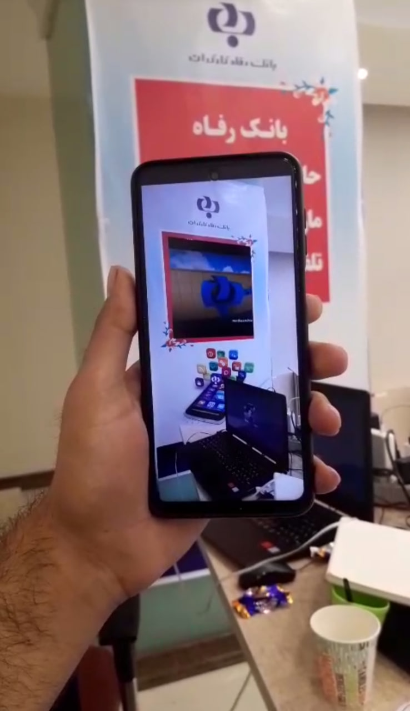
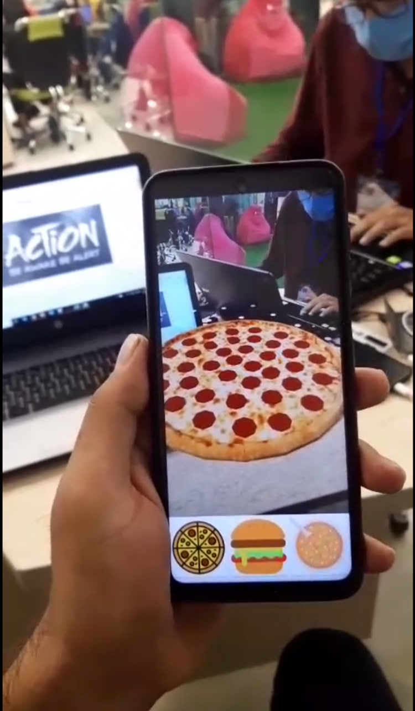
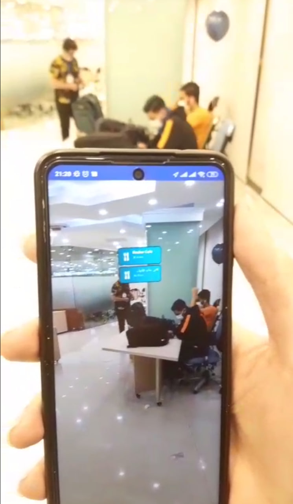

# MPM-Sharif-2020 Mobile Programming Marathon Project

## Project Overview

Congratulations on being a part of the MPM-Sharif-2020 mobile programming marathon! Our team, KTM, is proud to have secured the 5th position out of numerous talented teams in this highly competitive event held in Tehran. The marathon focused on fostering innovation and creative ideas in mobile applications, and our project utilized Augmented Reality (AR) technology to enhance user experiences in three exciting sections.

For more information about the MPM-Sharif-2020 marathon, visit the [official marathon website](http://mpm.sharif.ir/mpm8/).

## Project Description

### 1. Video in Camera Billboard

The first section of our project involved creating an innovative application that allowed users to experience video playback directly within their camera's viewfinder. By leveraging AR technology, we were able to superimpose videos on real-world surfaces, effectively turning any flat surface into a dynamic billboard. This functionality had various potential applications in marketing, advertising, and entertainment industries, enabling users to interact with digital content in a whole new way.

#### Video Showcase

### 2. Food 3D Model in Camera

The second section focused on enriching the dining experience for users by utilizing AR to showcase 3D models of food items within the camera view. This feature allowed users to visualize food items from a restaurant's menu in a more realistic manner before placing their orders. By integrating this technology into restaurant and food delivery applications, we aimed to enhance user engagement and provide a unique dining experience.

#### Video Showcase

### 3. AR-based Nearby Restaurant Finder

In the third section, we developed an AR-based nearby restaurant finder. Using location data and AR overlays, users could easily identify restaurants and their distances in real-time while exploring their surroundings. This feature aimed to simplify the process of finding and choosing nearby restaurants, making it convenient for users to discover new dining options in an interactive and engaging manner.

#### Video Showcase

## Features

- Augmented Reality technology integration
- Real-time video playback on any flat surface
- Interactive 3D models of food items
- Geolocation-based AR restaurant finder
- User-friendly and intuitive interface
- Seamless user experience

## Technologies Used

- Augmented Reality (AR) SDKs/Frameworks (e.g., ARKit, ARCore)
- Mobile Application Development (Platform-specific or Cross-platform)

## Team Members

- Hossein Bakand
- Vahid Safari
- Alireza Lorestani
- MohammadReza Sahebi
